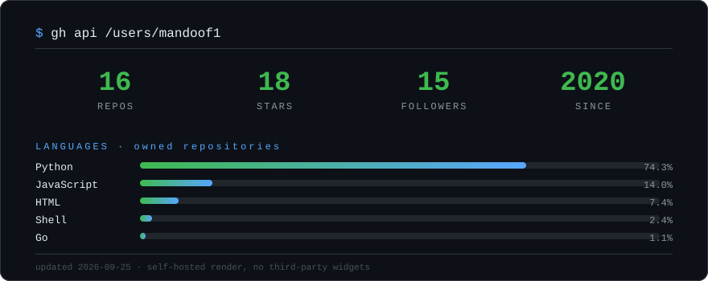
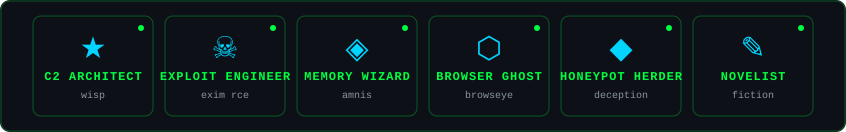

<!--
  ⚠️ privacy audit: zero location, zero IPs, zero creds. fiction with a keyboard.
-->
<div align="center">
  
</div>

<br/>

```text
$ whoami
hadi — security researcher, novelist, builder of encrypted things

$ cat interests.txt
offensive security · c2 frameworks · cryptography · memory systems
browser automation · self-hosted everything · speculative fiction

$ cat now.txt
building wisp · writing · breaking things responsibly
```

<br/>

<div align="center">
  
</div>

<br/>

<div align="center">
  
</div>

<div align="center">
  
</div>

<div align="center">
  
</div>

<br/>

## ▸ arsenal

| field | payload | status |
|---|---|---|
| [wisp](https://github.com/mandoof1/wisp) | encrypted C2 framework — Go implant, Python server, X25519 | [](https://github.com/mandoof1/wisp) |
| [amnis](https://github.com/mandoof1/amnis) | persistent memory + RAG + wiki for AI agents (MCP server) | [](https://github.com/mandoof1/amnis) |
| [browseye](https://github.com/mandoof1/browseye) | full browser control over WebSocket — tabs, DOM, automation | [](https://github.com/mandoof1/browseye) |
| [Exim RCE](https://github.com/mandoof1/Exim-Remote-Code-Execution) | remote code execution research | [](https://github.com/mandoof1/Exim-Remote-Code-Execution) |
| [honeypot-ui](https://github.com/mandoof1/honeypot-ui) | honeypot dashboard | [](https://github.com/mandoof1/honeypot-ui) |
| [sharpemu](https://github.com/mandoof1/sharpemu) | experimental PlayStation 5 emulator | [](https://github.com/mandoof1/sharpemu) |

<br/>

## ▸ medallions

<div align="center">
  
</div>

<br/>

## ▸ stack

<div align="center">
  
</div>

<br/>

## ▸ grid snake

<div align="center">
  
</div>

<br/>

## ▸ decrypt me

<details>
<summary><code>echo 'YXNrIG1lIGFib3V0IHRoZSBzdHVmZiBpIGJ1aWxkIOKAlCB0aGUgZXhwbG9pdHMsIHRoZSBmaWN0aW9uLCB0aGUgbWVtb3J5LiBpIG1pZ2h0IGFuc3dlci4=' | base64 -d</code></summary>

> ask me about the stuff i build — the exploits, the fiction, the memory. i might answer.

</details>

<br/>

<div align="center">
  
  <br/>
  <sub><code>stay paranoid · never trust the output</code></sub>
</div>
